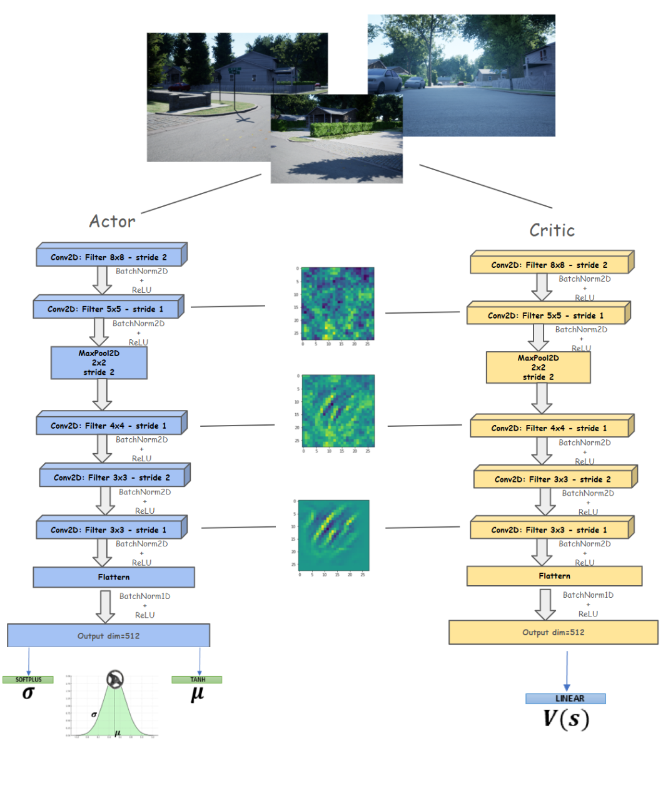

# Autonomous Car Navigation Using PPO
[](LICENSE)

> ℹ️ This work was inspired by [this project](https://github.com/bilalkabas/DRL-Nav): "DRL-Nav: Autonomous UAV Navigation via Deep Reinforcement Learning Using PPO". Here the steering action is continuous and the car is trained to navigate through an AirSim environment: AirSimNH, which can be downloaded [here](https://github.com/microsoft/airsim/releases)

This repository contains an implementation of Proximal Policy Optimization (PPO) for autonomous navigation in a neighborhood environment with a car. The goal is to make the car learn to drive in its environment while avoiding collisions.

## Contents

  - [Overview](#overview)
    - [Inputs](#inputs)
    - [Actions](#actions)
    - [Neural Network](#neural-network)
    - [Model structure](##Model structure)
  - [Environment setup to run the codes](#environment-setup-to-run-the-codes)
  - [How to run the training?](#how-to-run-the-training)
  - [How to run the pretrained model?](#how-to-run-the-pretrained-model)

## Overview:
In this project are present all the files necessary to make the PPO algorithm work in three main mode: sampling the action from a Normal distribution, a Beta distribution and a Flexible Beta distribution. Explainability is possible through GradCAM method.

### Inputs: 
images from the front camera of the car


### Actions:
continuous domain, steering action between [-1,1]


### Neural Network
In this work, a five layer convolutional neural network is used.

<p align="left">
  
</p> <br>


## Model structure:
<p align="left">
  
</p> <br>


## Environment setup to run the codes
#️⃣ **1. Clone the repository**

```
git clone https://github.com/Pedrazzini/AutonomousDriveEP.git
```

#️⃣ **2. From Anaconda command prompt, create a new conda environment**

I recommend you to use [Anaconda or Miniconda](https://www.anaconda.com/products/individual-d) to create a virtual environment.

```
conda create -n drl_nav python==3.8
```

#️⃣ 3. **Install required libraries**

Inside the main directory of the repo

```
conda activate drl_nav
pip install -r requirements.txt
```

#️⃣ 4. **(Optional) Install Pytorch for GPU**

> You must have a CUDA supported NVIDIA GPU.


<details>
<summary>Details for installation</summary>

<!-- - [Install CUDA](https://docs.nvidia.com/cuda/cuda-installation-guide-microsoft-windows/index.html) -->
- [Install Pytorch with the compatible CUDA version](https://pytorch.org/get-started/locally/)

For this project, I used CUDA 11.0 and the following conda installation command to install Pytorch:

```
conda install pytorch==1.7.1 torchvision==0.8.2 torchaudio==0.7.2 cudatoolkit=11.0 -c pytorch
```

</details>

#️⃣ **4. Edit `settings.json`**

Content of the settings.json should be as below:

> The `setting.json` file is located at `Documents\AirSim` folder.

```json
{
  "SeeDocsAt": "https://github.com/Microsoft/AirSim/blob/main/docs/settings.md",
  "SettingsVersion": 1.2,
  "LocalHostIp": "127.0.0.1",
  "SimMode": "Car",
  "ClockSpeed": 1,
  "ViewMode": "Fpv",
  "Vehicles": {
    "car0": {
      "VehicleType": "PhysXCar",
      "X": 0.0,
      "Y": 0.0,
      "Z": 0.0,
      "Yaw": 0.0
    }
  },
  "CameraDefaults": {
    "CaptureSettings": [
      {
        "ImageType": 0,
        "Width": 50,
        "Height": 50,
        "FOV_Degrees": 120
      },
      {
        "ImageType": 2,
        "Width": 50,
        "Height": 50,
        "FOV_Degrees": 120
      }
    ]
  }
}
```

## How to run the training?
Make sure you followed the instructions above to setup the environment.

#️⃣ **1. Download the training environment**

Go to the [releases](https://github.com/microsoft/airsim/releases) and download `AirSimNH.zip`. After downloading completed, extract it and follow the instruction on this [page](https://microsoft.github.io/AirSim/build_windows/).

#️⃣ **3. Now, you can open up environment's executable file and start the training**

So, inside the repository
```
python train.py
```


## Citation

[Proximal Policy Optimization Algorithms](https://arxiv.org/abs/1707.06347) by John Schulman, Filip Wolski, Prafulla Dhariwal, Alec Radford, and Oleg Klimov.


## Author

- [Ernesto Pedrazzini](https://github.com/Pedrazzini)

## License

This project is licensed under the [GNU Affero General Public License](LICENSE).
#   A u t o n o m o u s D r i v e E P

